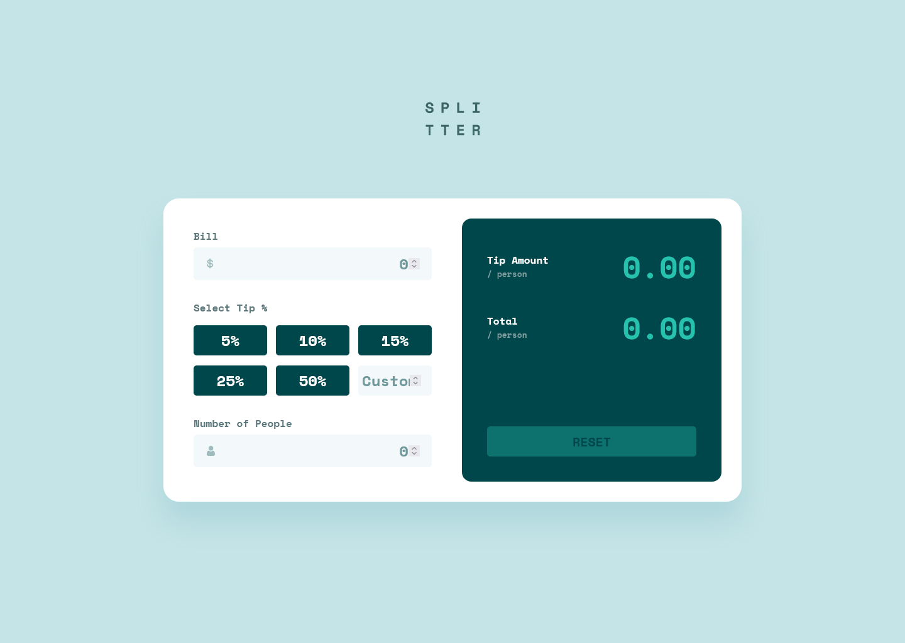

# Frontend Mentor - Tip calculator app solution

This is a solution to the [Tip calculator app challenge on Frontend Mentor](https://www.frontendmentor.io/challenges/tip-calculator-app-ugJNGbJUX). Frontend Mentor challenges help you improve your coding skills by building realistic projects.

## Table of contents

- [Overview](#overview)
  - [The challenge](#the-challenge)
  - [Screenshot](#screenshot)
  - [Links](#links)
- [My process](#my-process)
  - [Built with](#built-with)
  - [What I learned](#what-i-learned)
  - [Continued development](#continued-development)
  - [Useful resources](#useful-resources)
- [Author](#author)
- [Acknowledgments](#acknowledgments)

## Overview

### The challenge

Users should be able to:

- View the optimal layout for the app depending on their device's screen size
- See hover states for all interactive elements on the page
- Calculate the correct tip and total cost of the bill per person

### Screenshot



### Links

- Solution URL: [Add solution URL here](https://your-solution-url.com)
- Live Site URL: [Add live site URL here](https://your-live-site-url.com)

## My process

### Built with

- Semantic HTML5 markup
- CSS custom properties
- Flexbox
- CSS Grid
- Mobile-first workflow
- JS

### What I learned

I learned about the fieldset and legend tags to create sections inside a form tag, especially to a group checkbox or radio buttons.

Also, I learned how to apply styles to forms' elements(Change font size, colour, etc.) using the next block of style:

```css
button, input, select, textarea {
    font-family: inherit;
    font-size: 100%;
}
```

### Continued development

I started to learn about magic numbers, both, in CSS and programming(JS in my case). I wan to know more about this topic. Also, I want to improve about my knowlege and uses of the advanced selectors in CSS.

### Useful resources

- [Web Forms](https://developer.mozilla.org/en-US/docs/Learn/Forms/How_to_structure_a_web_form) - I used this to understand about the fieldset and legend tags.
- [CSS Grid](https://css-tricks.com/snippets/css/complete-guide-grid/) - This is a great post to understand about Grid. It helped me to get some results I didn't know how to do them because I didn't know the correct properties.
- [Advanced CSS selectors](https://www.davidvalverde.com/blog/selectores-avanzados-css/) - This post explain useful selectors in CSS.
- [Magic number in CSS](https://markus.oberlehner.net/blog/magic-numbers-in-css-how-to-identify-and-fight-them/#:~:text=At%20least%20in%20CSS%2C%20using,magic%20numbers%20into%20your%20codebase.) - I like this post because know I understand why is better to use the line-height property with an unitless value.

## Author

- Frontend Mentor - [@mariafmedinae](https://www.frontendmentor.io/profile/mariafmedinae)
